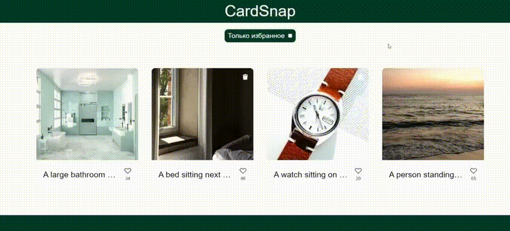

# CardSnap

## Краткое описание

Платформа для просмотра изображений ,их описаний с возможностью лайкать, удалять и просматривать карточки в полном размере.

[Открыть в браузере](https://destren1.github.io/CardSnap/)

## Функционал:

- Лайки: Понравилась карточка? Просто нажмите на сердечко, чтобы поставить лайк.
- Удаление: Легко удаляйте карточки, которые вам больше не нужны.
- Полный просмотр: Нажмите на карточку, чтобы увидеть её на отдельной странице с полным описанием и изображением в увеличенном размере.
- Фильтрация: Фильтруйте изображения по поставленным лайкам.

## Используемые технологии:
- HTML5
- SCSS
- React
- Redux и Redux-toolkit
- TS
- Взаимодействие с сервером через API-запросы
- Роутинг через React-router
